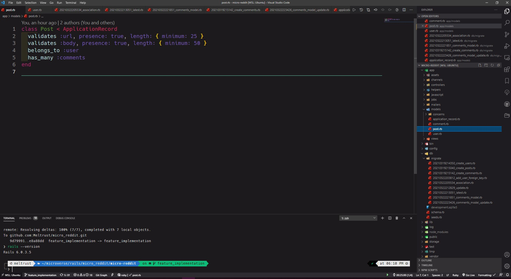

# micro_reddit

> A mini reddit app to practice active record.



Mini_reddit is a project done to practice active record validations, migrations, associations and models.

## Why is this useful?

It demonstrates how active record works.


## Built With

- Ruby language!
- Rails gem!
- Sqlite 3


## Getting Started

To get a local copy up and running follow these simple example steps.

To get a local copy up and running follow these simple example steps.

### Prerequisites

Ruby: 2.7.2
Rails: 6.0.3.5
Sqlite 3

### Setup

Instal gems with:

```
bundle install
```

Setup database with:

```
rails db:create
rails db:migrate
```

### Usage

Start server with:

```
rails server
```

Open `http://localhost:3000/` in your browser.

## Authors

👤 **Miguel Tapia Escalera**

- Github: [@Meltrust](https://github.com/Meltrust)
- Linkedin: [meltrust](https://www.linkedin.com/in/meltrust/)

👤 **Chukwuma Obasi**

- Github: [@ccobasi](https://github.com/ccobasi)
- Linkedin: [ Chukwuma Obasi ](https://www.linkedin.com/in/chukwuma-obasi/)

## 🤝 Contributing

Contributions, issues and feature requests are welcome!

Feel free to check the [issues page](issues/).

## Show your support

Give a ⭐️ if you like this project!

## Acknowledgments

- Hat tip to anyone whose code was used
- Inspiration
- etc

## 📝 License

This project is [MIT](https://mit-license.org/) licensed.

